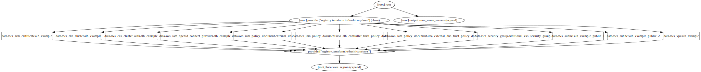

- [Deployment of `aws-load-balancer-controller` and `external-dns` in EKS.](#deployment-of-aws-load-balancer-controller-and-external-dns-in-eks)
  - [Directories](#directories)
    - [eks](#eks)
    - [Kubernetes-alb-config](#kubernetes-alb-config)
  - [Why Two Directories `eks` and `Kubernetes-alb-config` ?](#why-two-directories-eks-and-kubernetes-alb-config-)
  - [Applying the Configuration](#applying-the-configuration)
  - [Destroying Resources](#destroying-resources)
  - [Special Considerations](#special-considerations)

# Deployment of `aws-load-balancer-controller` and `external-dns` in EKS.

## Directories

### [eks](./eks/)

This directory includes the deployment of the EKS cluster along with network infrastrucutre which is obviously a hard pre-requisite for [aws-load-balancer-controller](https://kubernetes-sigs.github.io/aws-load-balancer-controller/v2.4/). I have used a public EKS cluster endpoint for simplifying the process.


### [Kubernetes-alb-config](./kubernetes-alb-config/)

This directory includes the deployment of 
- [aws-load-balancer-controller](https://kubernetes-sigs.github.io/aws-load-balancer-controller/v2.4/) as a helm release.
  - Policies required for  managing AWS load balancers.
  - Service Account creation 

- [external-ingress](https://github.com/kubernetes-sigs/external-dns/) as a helm release.
  - Policies required for managing route 53 zone.
  - Service Account creation 

- Route53 Public Hosted Zone to only restrict `external-dns` to specific hosted zone.
- Data sources for reading EKS and network configurations from [eks](./eks/) directory deployment.

- Example Nginx Webservice to finalise the example which includes
  - [Kubernetes Deployment](https://registry.terraform.io/providers/hashicorp/kubernetes/latest/docs/resources/deployment_v1)
  - [Kubernetes Ingress](https://registry.terraform.io/providers/hashicorp/kubernetes/latest/docs/resources/ingress_v1) with supported `aws-load-balancer-controller` annotations. for complete list of annotations refer at [here](https://kubernetes-sigs.github.io/aws-load-balancer-controller/v2.2/guide/service/annotations/) 
  - [Kubernetes Service](https://registry.terraform.io/providers/hashicorp/kubernetes/latest/docs/resources/service_v1)

- [poicies](./poicies/) directory, which includes the json formatt policies for `aws_loadbalancer_controller` and `external-dns` respectively.
- Security Groups for allowing inbound-outbound between required entities.
## Why Two Directories [`eks`](./eks/) and [`Kubernetes-alb-config`](./kubernetes-alb-config/) ?

This is the most reliable way to use the Kubernetes provider together with the AWS provider to create an EKS cluster. By keeping the two providers' resources in separate Terraform states (or separate workspaces using Terraform Cloud), we can limit the scope of changes to either the EKS cluster or the Kubernetes resources. This will prevent dependency issues between the AWS and Kubernetes providers, since terraform's [provider configurations must be known before a configuration can be applied](https://developer.hashicorp.com/terraform/language/providers/configuration)

For more details refer to [terraform-provider-kubernetes with EKS](https://github.com/hashicorp/terraform-provider-kubernetes/tree/main/_examples/eks) documentation.


## Applying the Configuration

To create and update the resources defined in this Terraform configuration, run the following command in the respective directories in the following sequence.

- It is must to deploy the `eks` directory configuration first. 

Pre-requisites: Terraform must be installed, even though the code does not stop you from using any version but`>= 1.x` is recommended.

```bash
# clone the repository
git clone https://github.com/ishuar/terraform-eks.git

# Change to eks directory for utilising this example of eks cluster can be deployed with other means or even pre-existing 
cd examples/cluster_with_alb
terraform init
terraform plan 
terraform apply

# Once the EKS is available , change the directory to kubernetes-alb-config 
cd ../kubernetes-alb-config 
terraform init 
terraform plan
terraform apply
```


## Destroying Resources

To destroy the resources created by this Terraform configuration, run the following command in the respective directories in the following sequence.

```bash
cd examples/cluster_with_alb/kubernetes-alb-config # ignore if this is your current directory.
terraform destroy -auto-approve # ignore "-auto-approve" if you don't want to autoapprove.

cd ../eks
terraform destroy -auto-approve # ignore "-auto-approve" if you don't want to autoapprove.
```


## Special Considerations

- You have to own a domain for the nginx webservice deployment and verification , in this example I own this domain `worldofcontainers.tk`.
- If you have the domain and it is not hosted by AWS , make sure to forward your domain resoulution to AWS nameservers which will be available as an terraform output `zone_name_servers` or in AWS route53 dns zone console view. 
- Worth reading [Setting up ExternalDNS for Services on AWS](https://github.com/kubernetes-sigs/external-dns/blob/master/docs/tutorials/aws.md) and [aws-load-balancer-controller](https://kubernetes-sigs.github.io/aws-load-balancer-controller/v2.4/).
